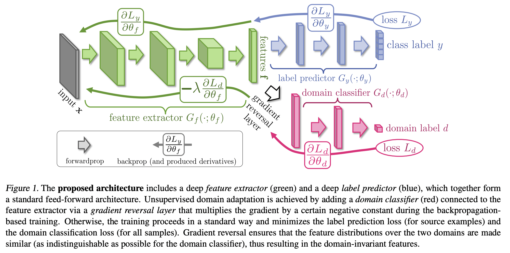
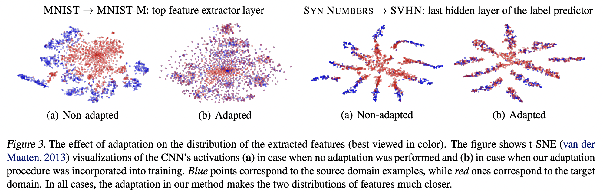
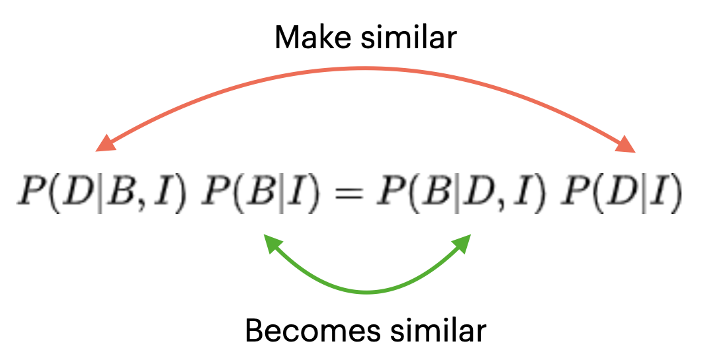
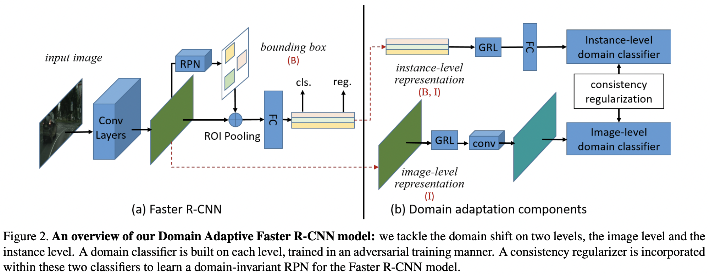

## [Unsupervised Domain Adaptation by Backpropagation](https://arxiv.org/pdf/1409.7495.pdf) 

Consider the task of image classification. The neural network usually used for such tasks is composed of a convolution backbone, called the feature extractor (parametrized by $\theta_{f}$) and a convolutional/fully-connected head known as the classifier (parametrized by $\theta_{c}$). Suppose this model has been trained on a dataset from a training distribution $\mathcal{S}$ (source domain) and we would like to now train this on another **unlabeled** dataset which follows a distribution $\mathcal{T}$ (target domain). $\mathcal{T}$ may contain images that are visually different from the images in $\mathcal{S}$, in terms of appearance of objects, lighting conditions, size and scale of the images, etc. This difference in appearance eventually translates to a different distribution of features extracted by feature extractor $f$. This phenomenon is called **covariant shift**. 

This is undesirable for us, since we (as humans) do not perceive the same entities differently if they are seen in a different environment or from a different perspective. Hence, what we would want is that the features extracted by $f$ for images from $\mathcal{T}$ have a similar distribution as for those in $\mathcal{S}$. To do this, this work introduces a **gradient reversal layer** (GRL) whose purpose is as follows.

We add another classification head to our network called the **domain classifier** $h_{d}$, parameterized by $\theta_{d}$. Based on the features extracted for any image $I$, this classifier outputs a probability to indicate whether $I$ belongs to $\mathcal{S}$ (class 0) or $\mathcal{T}$ (class 1). Now, the following procedure is followed.

 - Freeze the feature extractor, and train the domain classifier to differentiate between source and target domain images until convergence. This should not be very difficult in the beginning since the features for images from the two domains will be (potentially very) different.
 - Unfreeze the feature extractor and now train both the label and domain classification heads in the following manner.
    - For the label classification head, use standard crossentropy loss and propagate it's gradients unchanged through the head and the feature extractor. The update from gradients due to this loss will be as follows. Note that this head is only trained on samples drawn from $\mathcal{S}$, for which labels are available.
    $$
    \theta_{f} \leftarrow \theta_{f} - \eta \left(\frac{\partial L_{y}}{\partial \theta_{f}}\right) \quad ; \quad \theta_{c} \leftarrow \theta_{c} - \eta \left(\frac{\partial L_{y}}{\partial \theta_{c}}\right)
    $$
    
    - For the domain classification head, generate minibatches with samples drawn from both $\mathcal{S}$ and $\mathcal{T}$, and compute the domain clasification loss using crossentropy as usual. However, when its gradients are being computed for $\theta_{f}$, reverse the sign of its gradients by multiplying it with $-\lambda$ where $\lambda > 0$. The updates from these gradients will be as follows.
    $$
    \theta_{d} \leftarrow \theta_{d} - \eta \left(\frac{\partial L_{d}}{\partial \theta_{d}}\right) \quad ; \quad \theta_{f} \leftarrow \theta_{f} + \eta \lambda \left(\frac{\partial L_{d}}{\partial \theta_{f}}\right)
    $$

Overall, the updates for $\theta_{f}$, $\theta_{c}$ and $\theta_{d}$ will look like this.

$$
\theta_{f} \leftarrow \theta_{f} - \eta \left(\frac{\partial L_{y}}{\partial \theta_{f}} - \lambda \frac{\partial L_{d}}{\partial \theta_{f}} \right)
$$
$$
\theta_{c} \leftarrow \theta_{c} - \eta \left(\frac{\partial L_{y}}{\partial \theta_{c}}\right) 
$$
$$
\theta_{d} \leftarrow \theta_{d} - \eta \left(\frac{\partial L_{d}}{\partial \theta_{d}} \right)
$$

    

### What happens when we reverse the gradients?
The reason why our network doesn't generalize to $\mathcal{T}$ is because of the different distribution of features extracted by $f$ on those images. Our aim is therefore to update the feature extractor in a way such that it can generate domain-invariant features, i.e. images from $\mathcal{T}$ which have the same semantic content as images in $\mathcal{S}$ should have the same features. 

One consequence of features becoming domain-invariant is that the domain classifier $h_d$ will no longer be able to differentiate between images from $\mathcal{S}$ and $\mathcal{T}$. Hence, we want to update $\theta_{f}$ so that the loss incurred by $h_{d}$ is maximized while $\theta_{d}$ is updated so that it can be minimized. GRL simply reverses the gradients for $\theta_{f}$ resulting from $L_{d}$, so that features from updated $f$ confuse $h_{d}$ instead of aiding it. $h_{d}$ on the other hand tries to classify the two domains correctly despite receiving similar features for both by updating $\theta_{d}$ in the correct direction (negative of gradient).

The feature extractor and domain classifier therefore play a minimax game, which will result in the feature distribution for $\mathcal{T}$ to be very close to that of $\mathcal{S}$ at convergence. 

### Visualization
The paper shows the features extracted for images from the source and target domains reduced to 2D using t-SNE. We see that initially features from the two domains are quite separated, but after using this method, they are more homogeneously distributed with each other.

    

 

## [Domain Adaptive Faster R-CNN for Object Detection in the Wild](https://arxiv.org/pdf/1803.03243.pdf) (CVPR 2018)

We begin with the standard domain adaptation problem setting where we have a network with a feature extractor $f$ trained on a source domain dataset $\mathcal{S}$, and we would like to train on an unlabeled dataset $\mathcal{T}$ which could contain samples that are visually different from those in $\mathcal{S}$. 

This paper in particular focuses on object detection. Given an image $I$, we would like to predict a set of bounding boxes $B$ and class labels $C$ for the objects contained in each of those boxes. The joint distribution of images, their bounding boxes and class labels can be represented by $P_{\mathcal{S}}(I,B,C)$ for the source domain and $P_{\mathcal{T}}(I,B,C)$ for the target domain. The domain adaptation problem can thus be summarized as:

$$
P_{\mathcal{S}}(I,B,C) \neq P_{\mathcal{T}}(I,B,C)
$$

What we would like to do is, in some way, update our network parameters so that the two distributions come closer. This paper discusses two ways of doing that, enumerated below.

### Image-level adaptation
$$
P(I,B,C) = P(B, C|I)\; P(I)
$$
Intuitively, this formulation states that to bridge the gap between the two distributions, we must bring the distribution of image features $P(I)$ closer. This assumes that the bounding-box regressor and classifier are domain-invariant, and will generate consistent predictions if the features for the two domains follow a similar distribution.

### Instance-level adaptation
$$
P(I,B,C) = P(C|B,I) \; P(B,I) = P(C|B,I)\;P(B|I)\;P(I)
$$
Here we only assume that the distribution of class labels will be consistent if the joint distribution of image features and bounding boxes $P(B,I)$ is the same in both domains. $P(B,I)$ can further be broken down into $P(B|I)$ and $P(I)$, the former of which is usually modeled using a **Region Proposal Network** (RPN) in Faster R-CNN and the latter using a convolutional feature extractor. The paper notes that assuming the RPN to be domain-invariant is not a reasonable assumption, and provides a solution so it may be made to function in a domain-invariant manner. For that, we need to understand the concept of $\mathcal{H}$-divergence.

### Domain alignment with $\mathcal{H}$-divergence
Assume you have a set of classifiers $\mathcal{H}$ whose job is to predict whether a given sample $\mathbf{x}$ comes from $\mathcal{S}$ and $\mathcal{T}$. Here, $\mathbf{x}$ could be features extracted from an image. We can estimate a "distance" between the two domains using the error of these classifiers in differentiating between samples from different domains.

$$
d_{\mathcal{H}}(\mathcal{S}, \mathcal{T})=2\left( 1- \min_{h\in\mathcal{H}} \left[\text{err}_{\mathcal{S}}(h(\textbf{x}))+\text{err}_{\mathcal{T}}(h(\textbf{x}))\right]\right)
$$

Intuitively, if the best of the classifiers in $\mathcal{H}$ has a high error in telling between samples from $\mathcal{S}$ and $\mathcal{T}$ then the two distributions must be very close (small $d_{\mathcal{H}}$) and vice-versa. So if we would like to minimize the domain distance between $\mathcal{S}$ and $\mathcal{T}$, we want to maximize the error term on the right.

$$
\min_{f}\;d_{\mathcal{H}}(\mathcal{S},\mathcal{T}) = \max_{f}\; \min_{h\in \mathcal{H}}\left[\text{err}_{\mathcal{S}}(h(\textbf{x}))+\text{err}_{\mathcal{T}}(h(\textbf{x}))\right]
$$

### Joint adaptation
To make our RPN invariant, what we now do is introduce a domain label $D$ which indicates whether an image and its instance boxes come from the source or target dataset. We would want $P(B|I)$ to be independent of $D$:

$$
P(B|D,I) = P(B,I)
$$

We introduce two domain classifiers into our model: one which makes a domain prediction using the entire image as context, and another that predicts domain membership for each instance region in the image. These two essentially estimate $P(D|I)$ and $P(D|B,I)$. We can now use Bayes' rule to say the following.

    

If the predictions made by the two domain classifiers with image and instance level context becomes similar, then the RPN will automatically become domain invariant.

### Architecture
The model architecture augments Faster R-CNN with components that induce consistent domain classification using image-level and instance-level context. The model makes use of gradient reversal layers ([Ganin et al., 2014](https://arxiv.org/abs/1409.7495)) to train the feature extractor and domain classifiers adversarially so that image and instance level features become domain invariant. A consistency regularization is performed on predictions of the two domain classifiers to make the RPN domain invariant. 

    

The model is hence trained with four losses: 
 - The standard combination of object detection losses (bounding box regression and object classification) combined into $L_{det}$.
 - Domain classification loss for the image level classifier $L_{img}$.
 - Domain classification loss for the instance level classifier $L_{ins}$.
 - Consistency regularization loss between predictions of the instance and image level domain classifiers $L_{cst}$.

$$
\mathcal{L} = L_{det} + \lambda (L_{img} + L_{ins} + L_{cst})
$$