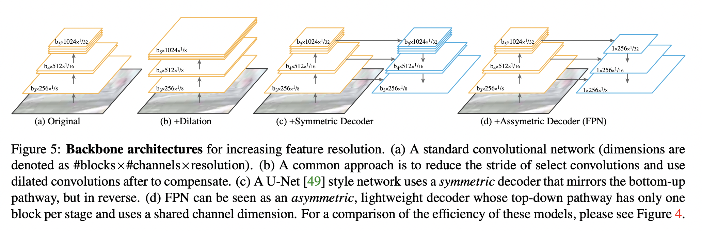
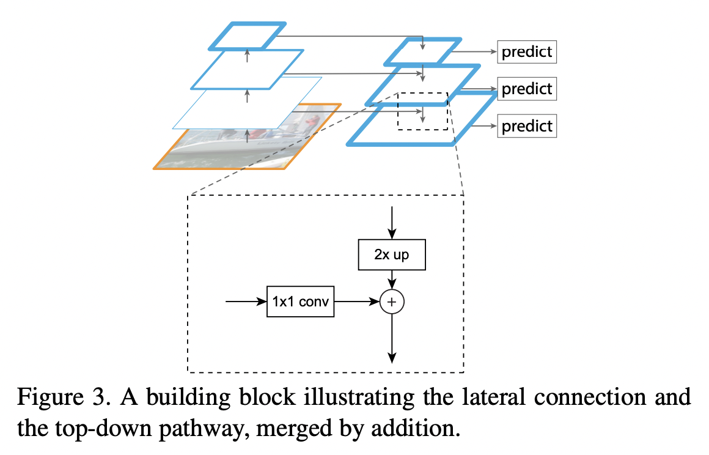
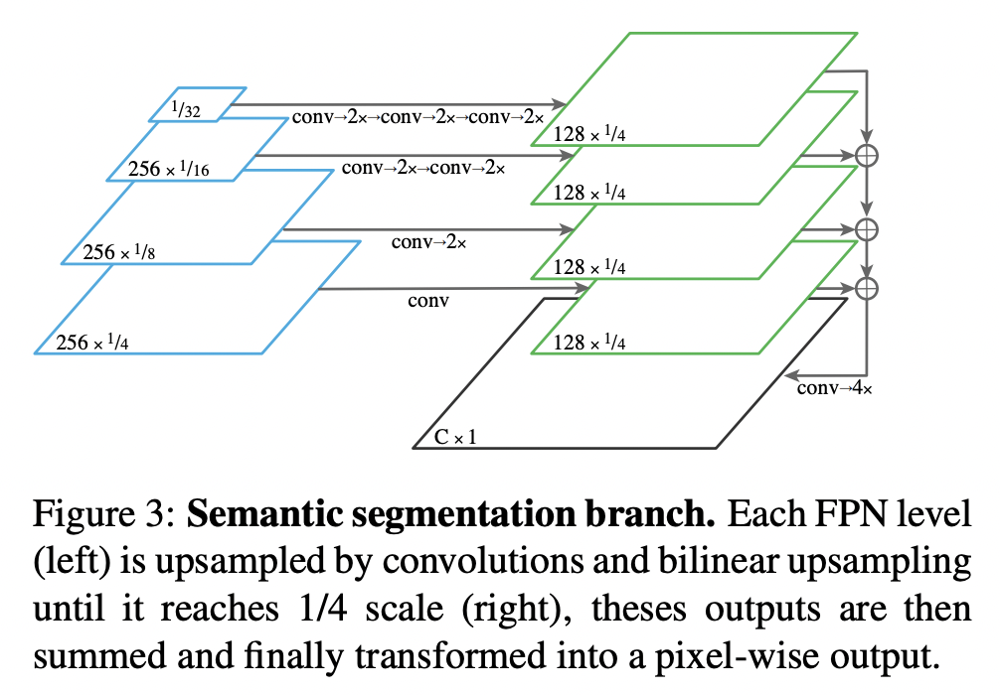

## [Panoptic Feature Pyramid Networks](https://arxiv.org/pdf/1901.02446.pdf)
This work extends the use of Feature Pyramid Networks (FPN) for both instance and semantic segmentation. 

	

 

### Model Architecture
The FPN is built by extracting outputs at different spatial resolutions from a backbone network, e.g. a ResNet. Then a top-down network is built which starts with the feature map having the lowest resolution transformed by a 1x1 convolution. The next feature map in the pyramid is formed by adding the previous feature map after upscaling by 2x and the backbone's feature of the next higher resolution after a 1x1 convolution. In all of these 1x1 convolutions, the number of feature maps is kept fixed (256 in the paper) for the top down branch.

	

**Instance segmentation.** The FPN is treated as a region proposal network (RPN) on which RoI pooling is performed, and then a common convolutional network is used to regress bounding box variables and class labels (in the case of Fast RCNN). It is also possible to attach an FCN on the head to generate segmentation masks for each class, as done in Mask RCNN.   

**Semantic segmentation.** The feature maps in the top down branch are all upscaled to a common resolution using a series of 1x1 convolutions and 2x upscaling operations, depending on the level at which that feature map is. This is doen to maintain high resolution features which consequentially provides cleaner stuff segmentations.

	

### Training
A linear combination of standard instance and semantic losses is used. Linear reweighting is needed since each of the individual loss terms have been normalized using different factors.

$$
L=\lambda_{i}\left(L_{c}+L_{b}+L_{m}\right) + \lambda_{s}L_{s}
$$

where $L_{c}$ is a classification loss (crossentropy), $L_{b}$ is a bounding box regression loss (smooth L1 loss), $L_{m}$ is a mask prediction loss (pointwise crossentropy) and $L_{s}$ is segmentation mask prediction loss (pointwise crossentropy).

### Inference
The bounding boxes, class labels and masks are predicted for instance classes separately, so are the pixel-wise labels for stuff classes. In case there are overlaps between the predictions of the two, they are removed by:

 - Giving higher preference to prediction with higher confidence score.
 - If the confidence scores are similar priority is given to instance class.
 - Any stuff segmentation labelled void and having less than a certain area threshold is removed.

