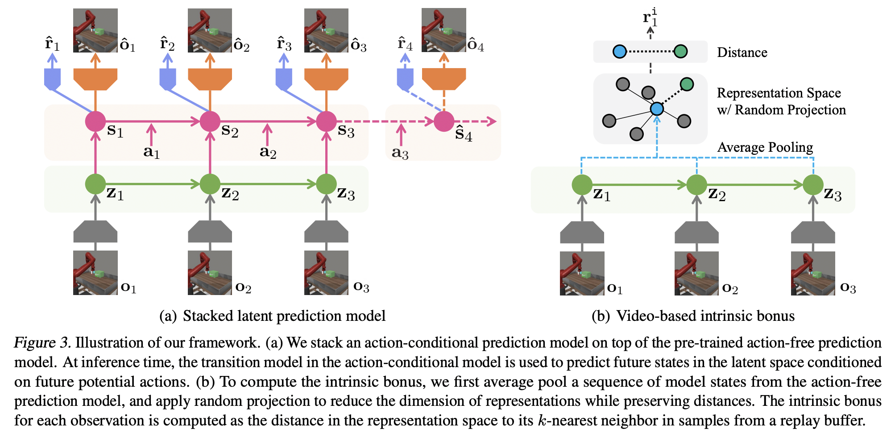
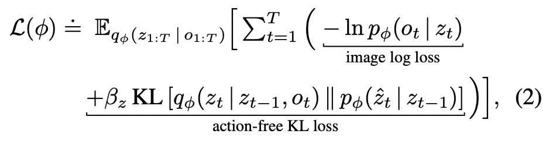
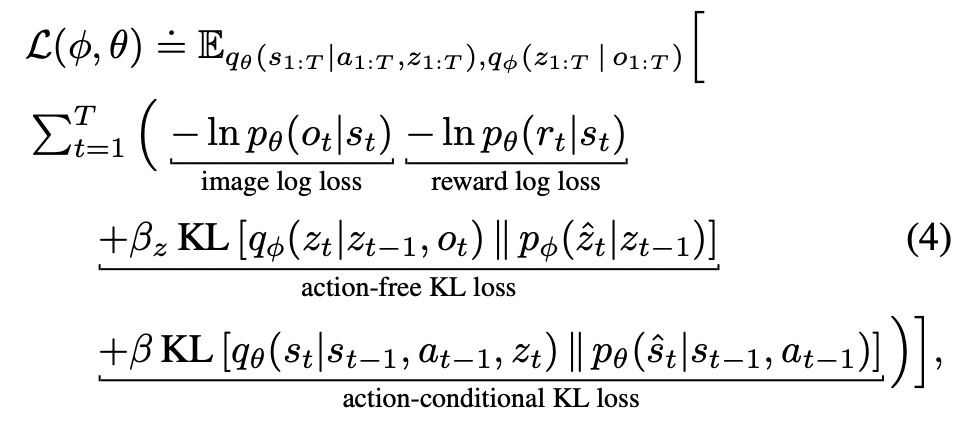
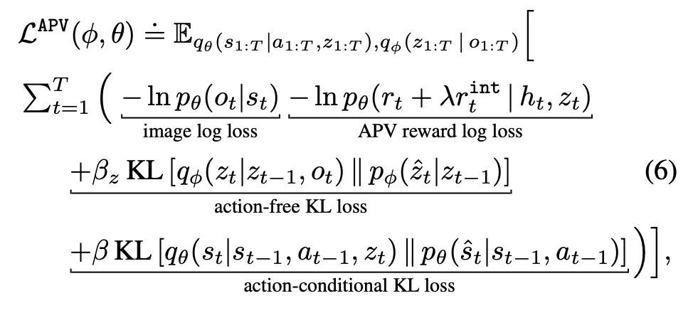

## [Reinforcement Learning with Action-Free Pre-Training from Videos](https://arxiv.org/pdf/2203.13880.pdf)
This work improves upon DreamerV2 ([Hafner et al., 2021](https://arxiv.org/abs/2010.02193)) by improving state representations generated by the encoder. They do so with an action-free pretraining task which learns richer state representations using readily available videos of certain tasks being solved (I did not clearly see any mention of "videos where the task is SOLVED" but I'm assuming that's the case). The paper mentions that the videos used in pretraining need not be from the same domain as the downstream tasks on which the agent will be finetuned. 

    

### **Reconstructing observations from latent**
We consider three networks here (with different sets of parameters for each, but are jointly optimized), which have the following functions.
 - Representation model, or the pixel encoder: $q_{\phi}(z_{t}|z_{t-1},o_{t})$
 - Transition model, which regresses future states in the latent space (modelled as an RSSM): $p_{\phi}(\hat{z_{t}}|z_{t-1})$
 - Image decoder, to reconstruct the observation frames: $p_{\phi}(\hat{o_{t}}|z_{t})$

In this task, given an observation, the representation model outputs its latent representation. Now the transition model regresses latent representations of future states (upto a horizon $T$) and at each time step, the decoder reconstructs the observation frame corresponding to the latent features. The following loss function is optimized, which: (i) maximizes the likelihood of observing a (real) frame given its latent features, and (ii) ensures the distributions of latent features predicted by the pixel encoder and by the transition model for a certain future time step are the same. 

    

### **Stacked latent prediction model**
This task is motivated by the fact that actions and corresponding rewards provide valuable information to the model. However, the paper notes that naively training an action-conditioned model with a reward predictor initialized using the action-free pretrained model causes the knowledge learnt by the latter to vanish. Hence, they stack an additional action-conditioned + reward prediction heaad over the action-free pretrained head and train it in a similar manner to predict future latent features, reconstruct the observations and predict the reward as well. The loss function for this is shown below.

    

### **Video-based intrinsic reward**
One requirement of learning good state representations is that the state space should be explored sufficiently. This third task ensures that the trajectories imagined by the model are as diverse as possible. The following training method is adopted to ensure this:
 - Given a trajectory of latent states $z_{t:t+T}$ from the action-free prediction model, generate an average "sequence" representation by performing average pooling across the sequence dimensions, denoted as $y_{t}=\text{Avg}(z_{t:t+T})$.
 - Perform a random projection $\psi$ of several such trajectories in a mini-batch to a lower dimensional space.
 - For every representation $\psi(y_{t})$, find it's $k$-nearest neighbor in the $\psi$ space: $\psi(y_{t}^{k})$ using a suitable distance metric.
 - Provide $r_{t}^{\texttt{int}}=||\psi(y_{t})-\psi(y_{t}^{k})||_{2}$ as a reward to be maximized.

This naturally ensures trajectories "on an average" to be as far apart from each other in the $\psi$ space, which translates to them being diverse in their original dimensionality.

The overall loss function for APV is showb below, which incorporates all the tasks above.

    

The paper reports results on several experiments where the pretrained model outperforms DreamerV2 on almost all benchmarks