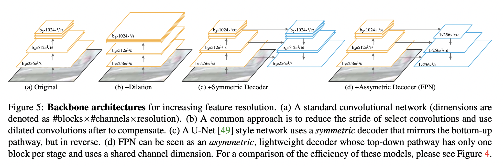
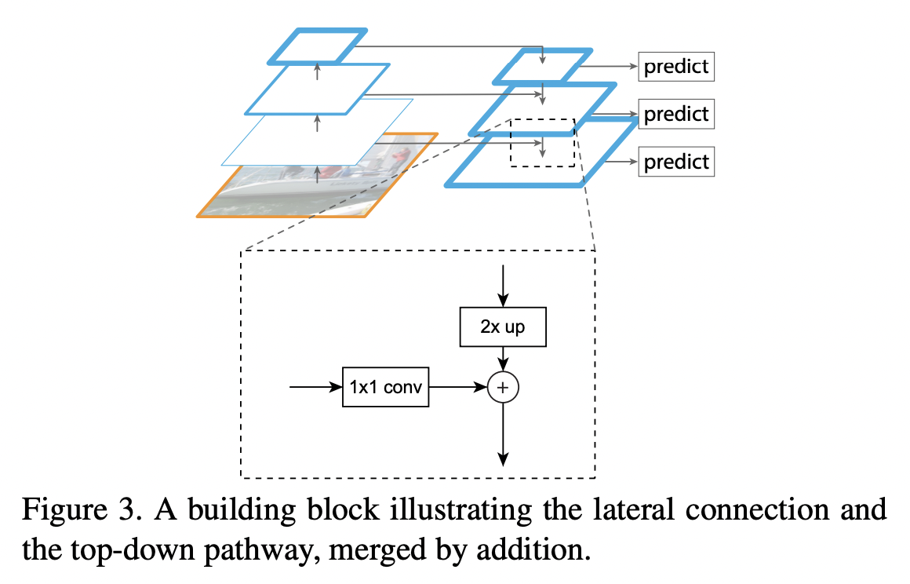
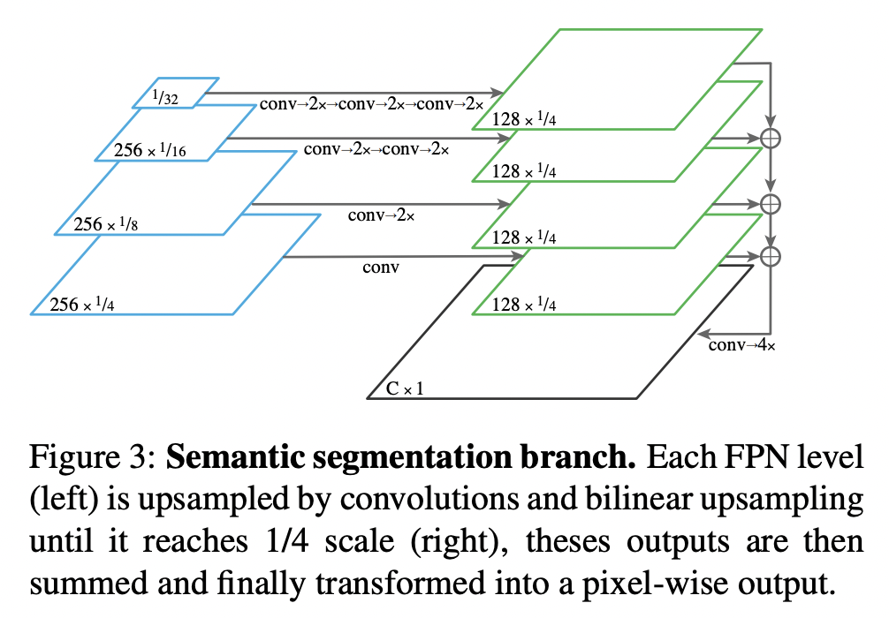
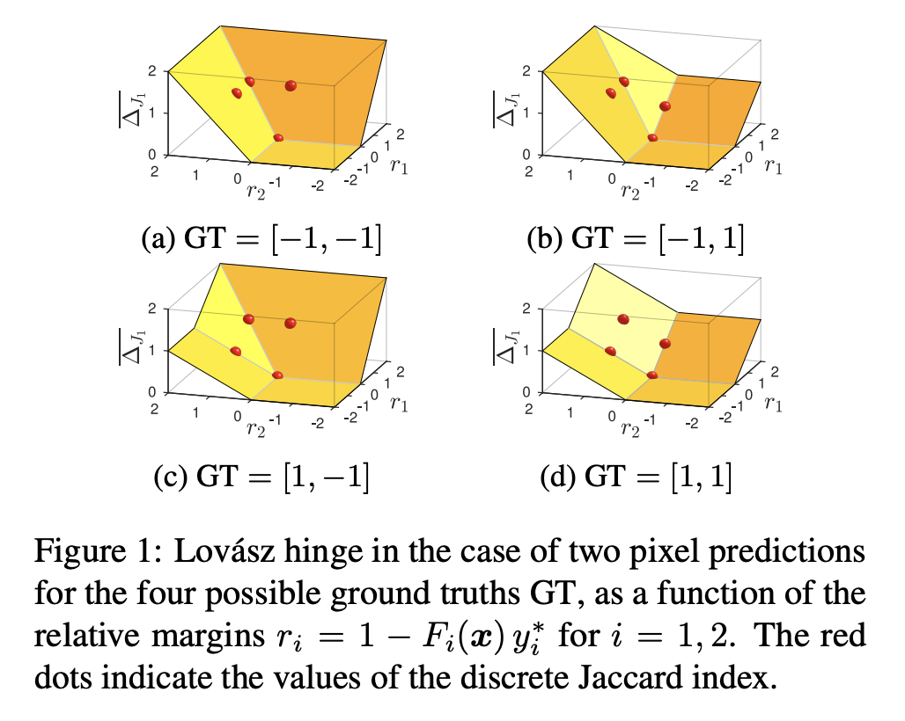
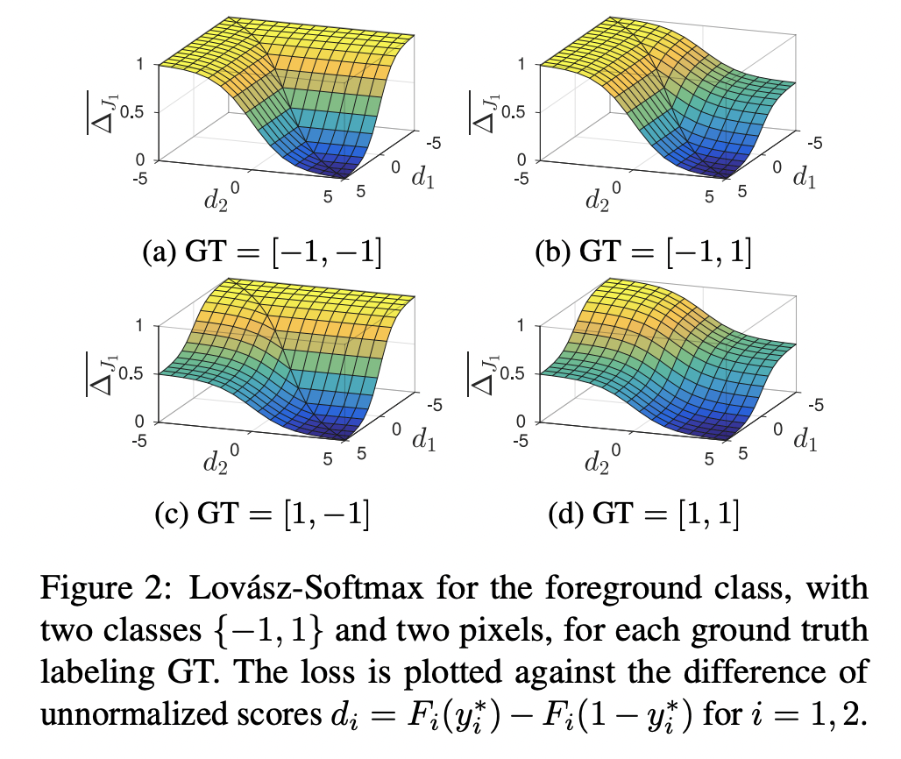
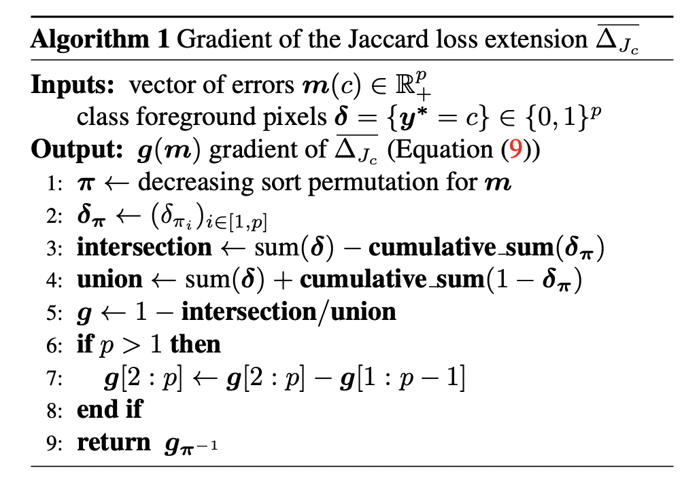

## [Panoptic Feature Pyramid Networks](https://arxiv.org/pdf/1901.02446.pdf)
This work extends the use of Feature Pyramid Networks (FPN) for both instance and semantic segmentation. 

	

 

### Model Architecture
The FPN is built by extracting outputs at different spatial resolutions from a backbone network, e.g. a ResNet. Then a top-down network is built which starts with the feature map having the lowest resolution transformed by a 1x1 convolution. The next feature map in the pyramid is formed by adding the previous feature map after upscaling by 2x and the backbone's feature of the next higher resolution after a 1x1 convolution. In all of these 1x1 convolutions, the number of feature maps is kept fixed (256 in the paper) for the top down branch.

	

**Instance segmentation.** The FPN is treated as a region proposal network (RPN) on which RoI pooling is performed, and then a common convolutional network is used to regress bounding box variables and class labels (in the case of Fast RCNN). It is also possible to attach an FCN on the head to generate segmentation masks for each class, as done in Mask RCNN.   

**Semantic segmentation.** The feature maps in the top down branch are all upscaled to a common resolution using a series of 1x1 convolutions and 2x upscaling operations, depending on the level at which that feature map is. This is doen to maintain high resolution features which consequentially provides cleaner stuff segmentations.

	

### Training
A linear combination of standard instance and semantic losses is used. Linear reweighting is needed since each of the individual loss terms have been normalized using different factors.

$$
L=\lambda_{i}\left(L_{c}+L_{b}+L_{m}\right) + \lambda_{s}L_{s}
$$

where $L_{c}$ is a classification loss (crossentropy), $L_{b}$ is a bounding box regression loss (smooth L1 loss), $L_{m}$ is a mask prediction loss (pointwise crossentropy) and $L_{s}$ is segmentation mask prediction loss (pointwise crossentropy).

### Inference
The bounding boxes, class labels and masks are predicted for instance classes separately, so are the pixel-wise labels for stuff classes. In case there are overlaps between the predictions of the two, they are removed by:

 - Giving higher preference to prediction with higher confidence score.
 - If the confidence scores are similar priority is given to instance class.
 - Any stuff segmentation labelled void and having less than a certain area threshold is removed.

 

## [The Lovász-Softmax Loss: A tractable surrogate for the optimization of intersection-over-union measure in neural networks](https://arxiv.org/pdf/1705.08790.pdf)
We usually train semantic segmentation models using a pixel-wise crossentropy loss. On the other hand, performance of these models during inference is measured using the Jaccard score, also called intersection-over-union (IoU) metric. Given a vector of ground truth class labels for each pixel $y$ and the model's discretized predictions $\hat{y}$, the Jaccard score for a class $c$ is given by:

$$
J_{c}(y, \hat{y}) = \cfrac{|\{y=c\} \cap \{\hat{y}=c\}|}{|\{y=c\} \cup \{\hat{y}=c\}|} 
$$

We could treat $1-J_{c}(y,\hat{y})$ as a risk function which must be minimized. The paper now presents an alternate formulation of this loss, as follows.

Consider $\textbf{M}_{c}$ as a vector of errors for class $c$. In the simplest case, we can consider it to be an indicator variable such that for pixel $i$, $\textbf{M}_{c}(i)=1$ if the pixel is misclassified, else $0$. 

$$
\textbf{M}_{c}(y,\hat{y}) = \{y=c,\hat{y}\neq c\} \cup \{y\neq c, \hat{y}=c\}
$$

Now the "Jaccard loss" can be rewritten as a function of the set $\textbf{M}_{c}$, making it a set function ($p$ is the number of elements in $\textbf{M}_{c}$):

$$
\Delta_{c}: \textbf{M}_{c}\in \{0,1\}^{p} \mapsto \cfrac{|\textbf{M}_{c}|}{|(y=c) \cup \textbf{M}_{c}|}
$$

The paper states that the above function has been shown to be submodular, which means it regards the following property: a set function $\Delta:\{0,1\}^{p}\mapsto \mathbb{R}$ is submodular if for all $\textbf{A},\textbf{B}\in \{0,1\}^{p}$:

$$
\Delta(\textbf{A}) + \Delta(\textbf{B}) \geq \Delta(\textbf{A}\cup \textbf{B}) + \Delta(\textbf{A}\cap \textbf{B})
$$

I'm not too well versed with the math behind this theory, but it turns out that the convex closure of such submodular functions is computable in polynomial time (for other set functions it is NP-hard), and it corresponds to the Lovász extension of set functions. The Lovász extension of a set function $\Delta: \{0,1\}^{p}\mapsto \mathbb{R}$ such that $\Delta(\textbf{0})=0$ is defined as:

$$
\overline{\Delta}: \textbf{m} \in \mathbb{R} \mapsto \sum_{i=1}^{p}m_{i} g_{i}(\textbf{m}) \\
\text{with } g_{i}(\textbf{m})=\Delta(\{\pi_{1},\dots,\pi_{i}\})-\Delta(\{\pi_{1},\dots,\pi_{i-1}\})
$$

where $\pi$ is a permutation that orders the components of $\textbf{m}$ in decreasing order. The paper visualizes the loss function surface for a simple example in two settings: (i) a binary foreground-background classification problem which gives rise to the Lovász-Hinge function, and (ii) the multi-class semantic segmentation problem which gives us the Lovász-Softmax function.

	
	

For the case of multi-class semantic segmentation, we define $\textbf{m}_{i}(c)$ as follows (for pixel index $i$ and class $c$):

$$
\textbf{m}_{i}(c)=\begin{cases}
1-f_{i}(c) &;\quad y_{i}=c \\
f_{i}(c) &; \quad \text{otherwise}
\end{cases}
$$

where $f_{i}(c)$ is the predicted class probability for class $c$ at that pixel. The following algorithm is now followed to compute the gradient of the Lovász softmax loss.

	

The paper closes with a note about dataset-mIoU vs. image mIoU. If at some point our model predicts a pixel's label as one that does not actually occur in the image, the loss for that particular class becomes $1$. Hence directly optimizing this function can cause performance with respect to dataset mIoU to degrade. Hence, it is suggested that losses be computed only for the classes that exist in the ground truth of the current image/mini-batch of images.