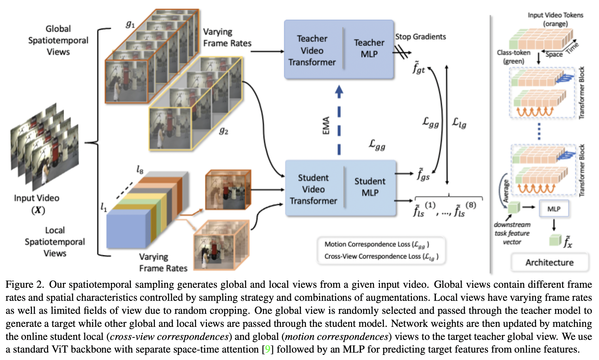
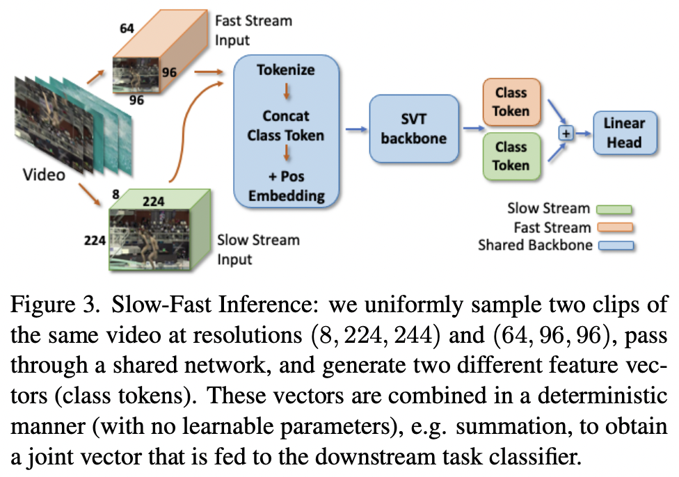
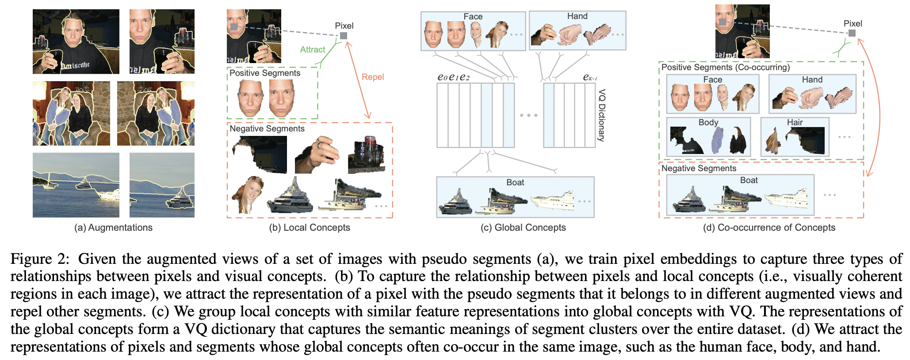
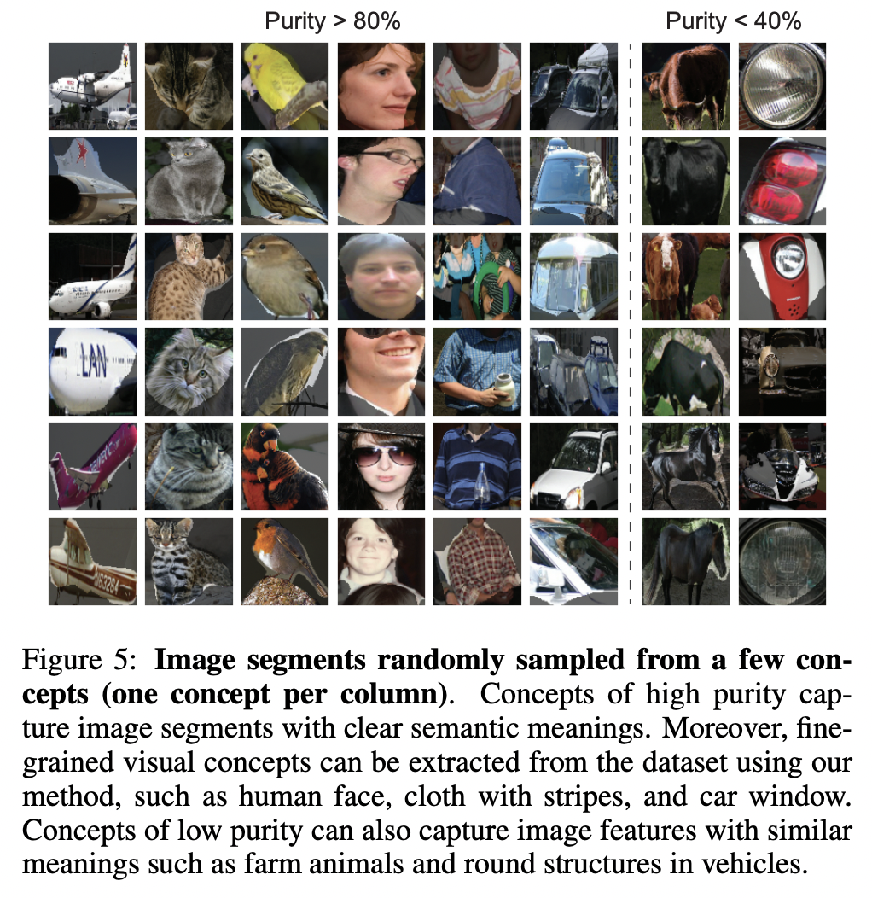

## [Self-supervised Video representation learning by Pace Prediction](https://arxiv.org/pdf/2008.05861.pdf) (ECCV 2020)

The paper makes use of the fact that as humans, we are able to distinguish between videos played at different paces (frame rates) if we have a general understanding of the content of the video. 

The pretext task is set up as a classification problem for the backbone of the model which needs to be pretrained. Given a sequence of frames that form a video, the method extracts several sub-videos out of it, each with a different "pace" defined by a parameter $p$. In this convention, $p=1$ denotes the normal speed of the video. $p<1$ indicates the video is being played in slow motion, hence keyframes changes every $1/p^{th}$ frame, and the blanks are filled using the previous frame. For $p>1$, the video is fast-forwarded such that every subsequent keyframe is sampled after $p$ frames.

    

The primary pretext task for the model is to predict the discretized pace variable: slow, normal or fast (one could add very slow/very fast based on certain heuristics). The crossentropy loss between the pace and the predicted pace is used to update the model.

**Contrastive Learning**. The authors also add an additional learning task which is trained using a contrastive loss. This task has two forms:
 - **Content based:** Positive pairs are sub-videos with different paces but taken from the same original video. Negative samples are sub-videos taken from other videos. This ensures that the model understands the content of the video disregarding the pace.
 - **Pace based:** Positive pairs are sub-videos with the same pace from (possibly) different videos. Negative samples are sub-videos with different paces. This forces the model to represent equally paced videos closer than those with other paces.

In either case, the following loss was optimized for positive representation pair $(z_{i}, z_{j})$ and set of negative samples $\tau$:

$$
L_{ctr}(z_{i},z_{j},\tau) = -\frac{1}{N}\log\left[\cfrac{\exp(z_{i}^{T}z_{j})}{\exp(z_{i}^{T}z_{j}) + \sum_{z_{k}\in \tau}\exp(z_{i}^{T}z_{k})}\right]
$$

The final loss is a linear combination of the classification and contrastive loss. In any experiment, any one form of the contrastive task is chosen.

$$
L = \lambda_{cls}L_{cls} + \lambda_{ctr}L_{ctr}
$$

    

From experiments, it is observed that performance on the context-based contrastive learning task is better than the pace-based variant, and the authors reason that this happens because there are only 3-4 classes of different paces in their model formulation, which limits the effectiveness of contrastive learning which trains models better in presence of large diversity. The performance on pace prediction task is higher than any of the contrastive learning tasks, which means it adds significant learning value to the network. 

  

## [Self-supervised Video Representation Learning with Cross-Stream Prototypical Contrasting](https://arxiv.org/pdf/2106.10137.pdf) (WACV 2022)
This paper used RGB content and optical flow as two separate "streams" of a given video. The premise of this method is that any changes in the RGB content across frames of a video will be reflected in the optical flow as well, which means the representations of the RGB channel should be predictable using those of the optical flow channel and vice-versa. The overall method is reminiscent of SwAV ([Caron et al., 2021](https://arxiv.org/pdf/2006.09882.pdf)). 

The overall pretraining method consists of two phases: **single stream** and **cross-stream** learning, where RGB pixels and optical flow are the two streams. Architecturally, each stream consists of an encoder $f_{s}$ and a set of learnable embeddings $C_{s}$ which can be implemented as the weights of an unbiased linear layer.  

### **Single stream learning**
In this method, encoder $f_{s}$ and embeddings $C_{s}$ are trained using data from their own stream. 
 - Consider data point (image) $x_{s}$ at any point of time in this stream. We first generate two views of $x_{s}$ (using data augmentation) $x_{s}^{1}$ and $x_{s}^{2}$. 
 - These are passed through $f_{s}$ to obtain their latent features $z_{s}^{1}$ and $z_{s}^{2}$. 
 - The features are now mapped onto the set of $K$ prototype vectors $C_{s}=\{c_{s}^{1},\dots,c_{s}^{k}\}$ to obtain the soft cluster assignments $q_{s}^{1}$ and $q_{s}^{2}$. 
 - The following loss is computed and the embeddings and encoder are updated to optimize it.

$$
L_{s}^{\text{Single-stream}}(z_{s}^{1},z_{s}^{2})=l_{s}(z_{s}^{1},q_{s}^{2}) + l_{s}(z_{s}^{2},q_{s}^{1})
$$
$$
l_{s}(z_{s}^{1},q_{s}^{2})=-\sum_{k}q_{s}^{2,(k)}\log\cfrac{\exp(z_{s}^{1}\cdot c_{s}^{k} / \tau)}{\sum_{k'}\exp(z_{s}^{1}\cdot c_{s}^{k'}/ \tau)}
$$

This loss, in effect, enhances the similarity of $z_{s}^{i}$ and $c_{s}^{k}$ if its membership to $c_{k}$ given by $q_{s}^{2,(k)}$ is high. The soft assignments to clusters are learnt by solving the optimal transport problem:

$$
\max_{Q\in \mathcal{Q}}\;\text{Tr}(Q^{T}C_{s}^{T}Z) + \epsilon H(Q)
$$

In the above problem, the second term is the entropy of $Q$ which helps prevent degenerate solutions such as all data points getting assigned to the same cluster (consequently, same embeddings for all). The solution to this is found using the Sinkhorn-Knopp algorithm, which looks like:

$$
Q^{*}=\text{Diag}(\alpha)\exp\left(\frac{1}{\epsilon}C_{s}^{T}Z\right)\text{Diag}(\beta)
$$

where $\alpha$ and $\beta$ are normalization vectors such that $Q^*$ is a probability matrix. 

### **Cross-stream learning**
This learning stage is performed after single stream learning. In this method, both encoders and set of prototype vectors are trained in an alternating manner using their own as well as the other encoder's representations. The loss function now looks like this: 

$$
\mathcal{L}_{s}^{\text{Cross-stream}}=(z_{s}^{1},z_{s}^{2},z_{t}^{1},z_{t}^{2})
$$
$$
=L_{s}(z_{s}^{1},z_{s}^{2},z_{t}^{1},q_{t}^{2})+L_{s}(z_{s}^{1},z_{s}^{2},z_{t}^{2},q_{t}^{1})+L_{s}(z_{s}^{1},z_{t}^{1},z_{t}^{2},q_{s}^{2})+L_{s}(z_{s}^{2},z_{t}^{1},z_{t}^{2},q_{s}^{1})
$$
$$
L_{s}(z_{s}^{1},z_{s}^{1},z_{t}^{1},q_{t}^{2})=l_{s}(z_{s}^{1},q_{t}^{2})+l_{s}(z_{s}^{2},q_{t}^{2})+l_{s}(z_{t}^{1},q_{t}^{2})
$$

where $l_{s}$ is the same as defined before. This loss ensures predictability of cluster assignments of a stream using features of an augmented version of its own stream, plus features of two views of the other stream. Training using this loss is performed in an alternating fashion: the encoder and prototypes of stream $s$ are trained while keeping those of stream $t$ frozen, and vice versa after few optimization steps.

    

 

## [Self-supervised Video Transformer](https://arxiv.org/pdf/2112.01514.pdf) (CVPR 2022)
This paper trains a vision transformer architecture for video understanding using a self-supervision-based pretext task. The training method they adopt is very similar to the multi-crop strategy used in training DINO ([Caron et al., 2021](https://arxiv.org/pdf/2104.14294.pdf)) where, from an image, 2 global and $K$ local views are extracted (essentially crops of the image at varying views and areas) and similarity is enforced between representations of global-global and local-global views. In this paper, the following methodology is adopted.

    

### **Data preparation**
For a video $\{x_{i}\}_{t=1}^{N}$ of length $N$ frames, certain sub-clips (called "views") are extracted using the following heuristics.
 - **Global views**: These consist of randomly selected frames from 90% of the video's total length, with spatial resolution $(224, 224)$. Sampling of frames is performed at two frame rates, $T=\{8,16\}$. 2 such clips are extracted, denoted as $(g_{1},g_{2})$.
 - **Local views**: These consist of randomly select frames forming $1/8^{th}$ of the video's total length and about 40% spatial area of the frames. Four frame rates are used while sampling, $T=\{2,4,8,16\}$ and spatial resolution is fixed at $(96,96)$. 8 such local views are generated, $\{l_{1},\dots,l_{8}\}$. 

Each frame in every clip has RGB channels, making the overall shape of the input $(C\times T\times W\times H)$. Just like ViT ([Dosovitskiy et al., 2021](https://arxiv.org/pdf/2010.11929.pdf)), each input is chunked into visual tokens along the spatial dimensions (at most 196 in number) and temporal tokens along the temporal dimension (at most 16 in number). 

### **Dynamic positional encoding**
Since the transformer now has a temporal dimension and deals with varying resolutions, it is not possible to use vanilla positional embeddings along with the visual and temporal tokens. This work trains separate learnable positional embeddings for spatial and temporal dimensions. Embeddings corresponding to the highest spatial and temporal resolutions are initialized. If the spatial resolution is lower than $224$ or sampling rate is less than $16$, the embeddings are interpolated to fill in the gaps. The positional embeddings are tied to the frame indices in the original video. However it is noted that the encodings do not incorporate any time-stamp related information when learnt, which indicates that the relative ordering of frames should be sufficient positional information.

### **Network architecture**
The paper follows a teacher-student network setup similar to BYOL ([Grill et al., 2020](https://arxiv.org/pdf/2006.07733.pdf)). Two video transformer models are intialized as exact replicas of each other. One network is the "student" which is updated by using gradients and used during inference after pre-training. The other network is the "teacher" which is not updated by gradients, but as an exponential moving average of the student network. The purpose of the teacher model is to provide target representations for the student network to match which are consistent for similar views. Updating it to move closer to the student model through an EMA prevents degenerate solutions such as all representations collapsing to the same feature vector.

$$
\theta_{\text{teacher}} = \tau \cdot \theta_{\text{teacher}} + (1-\tau) \cdot \theta_{\text{student}}\quad ;\quad \tau \text{ is set close to 1.0}
$$

### **Training**
The views extracted from the videos are first augmented using standard transformations like color jitter, gray scaling, gaussian blurring and solarization. For datasets not containing flip equivariant classes (e.g. walking left/right), flip based augmentations are also used. As mentioned earlier, the loss function ensures similarity between representations of local-global and global-global views.

$$
\mathcal{L} = \mathcal{L}_{lg} + \mathcal{L}_{gg}
$$

The output representation $f$ for any view are transformed using a softmax-like function ($\tau$ is a temperature parameters to control sharpening of the distribution).

$$
\tilde{f}[i] = \cfrac{\exp(f[i])/\tau}{\sum_{i=1}^{n}\exp(f[i])/\tau} 
$$

The loss between global views is termed the **motion-correspondence loss**, since it ensures consistent representation from the student and teacher (latter being the target) for two views from the same video containing different motion content ($\langle.,.\rangle$ is the inner product operation).

$$
\mathcal{L}_{gg} = -\langle\tilde{f}_{g_1}, \log(\tilde{f}_{g_{2}})\rangle
$$

The second loss ensures cross view similarity in representations. The teacher model provides target representation using the global view and the representations of each local view obtained from the student model are trained to be consistent with it.

$$
\mathcal{L}_{lg}= -\sum_{i=1}^{8}\langle \tilde{f_{g_{t}}},\log \tilde{f}_{l_{s}}^{(i)}\rangle
$$

### **Slow-Fast Inference**
To sufficiently capture information along spatial and temporal dimension during inference, slow-fast inference is adopted where two views of the video are used to generate the final feature vector: one view has high spatial resolution but low frame rate (slow) and the other has low spatial resolution but high frame rate (fast). The student model is used to separately generate feature vectors for the two views and the final vector is generated by simple aggregation (e.g. addition) of the two vectors.

    

 

## [Self-supervised Semantic Segmentation Grounded in Visual Concepts](https://arxiv.org/pdf/2203.13868.pdf) (CVPR 22)
This paper aims to learn semantic feature representations by clustering features of pixels that belong to similar visual concepts at 3 different levels. Consider an image where two people are sitting on a couch. 
 - The lowest level of concepts, known as **local concepts**, could be individual instance of body parts of people such as face, hair, hands, etc. 
 - The second level of concepts, known as **global concepts**, aim to learn similar representations for individual instances of the same local concept even if they belong to different semantic entities. For example, faces of all people in an image, all chairs at a dining table, etc.
 - The third level of concepts, known as **co-occurring concepts**, relates the co-occurrence of different global concepts across images. For example, faces, hands and other body parts of a human always occur together and should have similar representations.

    

### **Learning local concepts**
For every image, two views are generating by applying two random augmentations which consist of random cropping and random color jittering. Representations generated by the encoder for each pixel are clustered together using non-parametric methods like super-pixels or contours. From the extracted image segments, the pixels belonging to the same concept in the two views form a positive pair and those from other concepts form negative samples. A pixel-to-segment contrastive loss is used to enforce similar representations for a pixel and the average representation of the segment it belongs to.

$$
\mathcal{L}_{s}(p) = -\log \cfrac{\sum_{s\in\mathcal{S}^+}\exp(\text{sim}(z_{p},z_{s})/\tau)}{\sum_{s\in\mathcal{S}^{+}\cup \mathcal{S}^-}\exp(\text{sim}(z_{p},z_{s})/\tau)} 
$$

The average representation of a segment is the average of all pixel representations belonging to it: $z_{s}=\sum_{p\in s}z_{p}/|s|$.

### **Learning global concepts**
Representations of similar local concepts with multiple instance in one image or across images need to be made similar, else they will be treated as negative samples by the previous method. To that end, the paper uses **vector quantization** (VQ) to represent global concepts in the dataset. A codebook of $K$ vectors $\textbf{E}=[e_{0},e_{1},\dots,e_{K-1}]$ is initialized, each representing one global concept. In each training iteration, every image segment is assigned its closest global concept using cosine similarity.

$$
k=\argmax_{j} \;\text{sim}(z_{s},e_{j})
$$

The loss function maximized the cosine similarity between representations of the image segment and the mapped global concept.

$$
\mathcal{L}_{v}=(1-\text{sim}(\text{sg}(z_{s}),e_{k})) +\beta(1-\text{sim}(z_{s},\text{sg}(e_{k}))) 
$$

The two features are optimized separately by using stop gradient ($\text{sg}$) on the other vector in each instance.

### **Co-occurrence of concepts**
As mentioned earlier, it is important to capture similarities between global concepts that naturally occur together. For every pixel, we first look up the global concept it belongs to by looking up its image segment in the VQ dictionary. Then, other global concepts that occur in the same image form positive pairs ($\mathcal{C}^+$) and the others form negative pairs ($\mathcal{C}^-$). A contrastive loss is used like before.

$$
\mathcal{L}_{c}(p) = -\log \cfrac{\sum_{s\in\mathcal{C}^+}\exp(\text{sim}(z_{p},z_{s})/\tau)}{\sum_{s\in\mathcal{C}^{+}\cup \mathcal{C}^-}\exp(\text{sim}(z_{p},z_{s})/\tau)} 
$$

Examples of some concepts extracted from the PASCAL VOC 2012 dataset are shown in the mosaic below.

    

