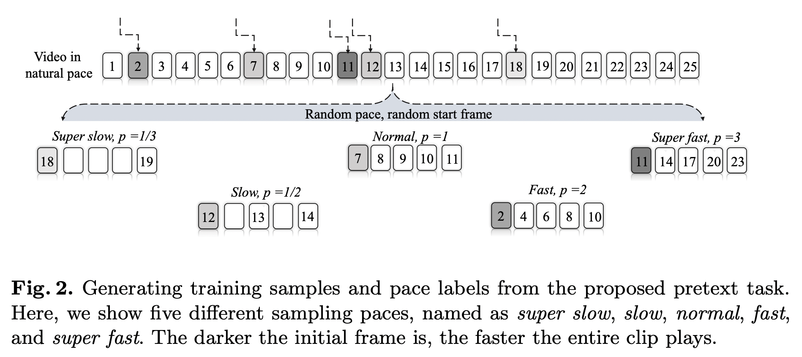
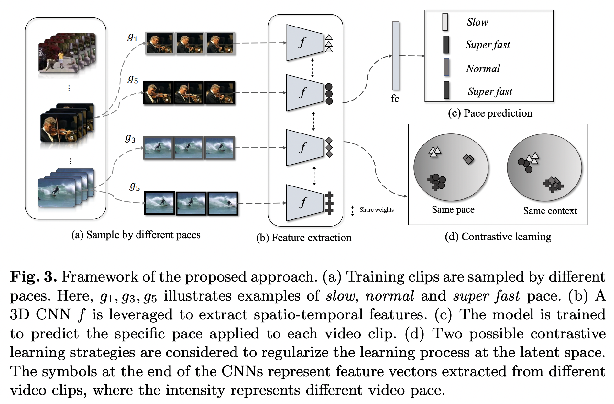
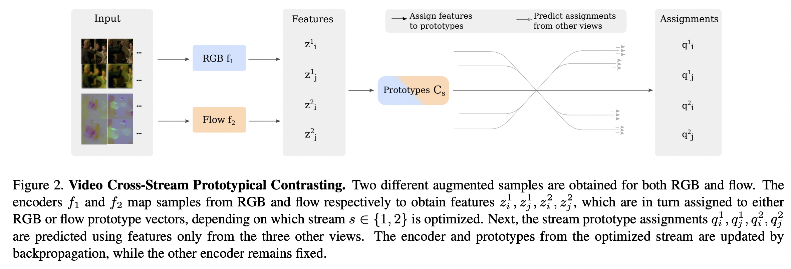

## [Self-supervised Video representation learning by Pace Prediction](https://arxiv.org/pdf/2008.05861.pdf) (ECCV 2020)

The paper makes use of the fact that as humans, we are able to distinguish between videos played at different paces (frame rates) if we have a general understanding of the content of the video. 

The pretext task is set up as a classification problem for the backbone of the model which needs to be pretrained. Given a sequence of frames that form a video, the method extracts several sub-videos out of it, each with a different "pace" defined by a parameter $p$. In this convention, $p=1$ denotes the normal speed of the video. $p<1$ indicates the video is being played in slow motion, hence keyframes changes every $1/p^{th}$ frame, and the blanks are filled using the previous frame. For $p>1$, the video is fast-forwarded such that every subsequent keyframe is sampled after $p$ frames.

    

The primary pretext task for the model is to predict the discretized pace variable: slow, normal or fast (one could add very slow/very fast based on certain heuristics). The crossentropy loss between the pace and the predicted pace is used to update the model.

**Contrastive Learning**. The authors also add an additional learning task which is trained using a contrastive loss. This task has two forms:
 - **Content based:** Positive pairs are sub-videos with different paces but taken from the same original video. Negative samples are sub-videos taken from other videos. This ensures that the model understands the content of the video disregarding the pace.
 - **Pace based:** Positive pairs are sub-videos with the same pace from (possibly) different videos. Negative samples are sub-videos with different paces. This forces the model to represent equally paced videos closer than those with other paces.

In either case, the following loss was optimized for positive representation pair $(z_{i}, z_{j})$ and set of negative samples $\tau$:

$$
L_{ctr}(z_{i},z_{j},\tau) = -\frac{1}{N}\log\left[\cfrac{\exp(z_{i}^{T}z_{j})}{\exp(z_{i}^{T}z_{j}) + \sum_{z_{k}\in \tau}\exp(z_{i}^{T}z_{k})}\right]
$$

The final loss is a linear combination of the classification and contrastive loss. In any experiment, any one form of the contrastive task is chosen.

$$
L = \lambda_{cls}L_{cls} + \lambda_{ctr}L_{ctr}
$$

    

From experiments, it is observed that performance on the context-based contrastive learning task is better than the pace-based variant, and the authors reason that this happens because there are only 3-4 classes of different paces in their model formulation, which limits the effectiveness of contrastive learning which trains models better in presence of large diversity. The performance on pace prediction task is higher than any of the contrastive learning tasks, which means it adds significant learning value to the network. 

  

## [Self-supervised Video Representation Learning with Cross-Stream Prototypical Contrasting](https://arxiv.org/pdf/2106.10137.pdf) (WACV 2022)
This paper used RGB content and optical flow as two separate "streams" of a given video. The premise of this method is that any changes in the RGB content across frames of a video will be reflected in the optical flow as well, which means the representations of the RGB channel should be predictable using those of the optical flow channel and vice-versa. The overall method is reminiscent of SwAV ([Caron et al., 2021](https://arxiv.org/pdf/2006.09882.pdf)). 

The overall pretraining method consists of two phases: **single stream** and **cross-stream** learning, where RGB pixels and optical flow are the two streams. Architecturally, each stream consists of an encoder $f_{s}$ and a set of learnable embeddings $C_{s}$ which can be implemented as the weights of an unbiased linear layer.  

### **Single stream learning**
In this method, encoder $f_{s}$ and embeddings $C_{s}$ are trained using data from their own stream. 
 - Consider data point (image) $x_{s}$ at any point of time in this stream. We first generate two views of $x_{s}$ (using data augmentation) $x_{s}^{1}$ and $x_{s}^{2}$. 
 - These are passed through $f_{s}$ to obtain their latent features $z_{s}^{1}$ and $z_{s}^{2}$. 
 - The features are now mapped onto the set of $K$ prototype vectors $C_{s}=\{c_{s}^{1},\dots,c_{s}^{k}\}$ to obtain the soft cluster assignments $q_{s}^{1}$ and $q_{s}^{2}$. 
 - The following loss is computed and the embeddings and encoder are updated to optimize it.

$$
L_{s}^{\text{Single-stream}}(z_{s}^{1},z_{s}^{2})=l_{s}(z_{s}^{1},q_{s}^{2}) + l_{s}(z_{s}^{2},q_{s}^{1})
$$
$$
l_{s}(z_{s}^{1},q_{s}^{2})=-\sum_{k}q_{s}^{2,(k)}\log\cfrac{\exp(z_{s}^{1}\cdot c_{s}^{k} / \tau)}{\sum_{k'}\exp(z_{s}^{1}\cdot c_{s}^{k'}/ \tau)}
$$

This loss, in effect, enhances the similarity of $z_{s}^{i}$ and $c_{s}^{k}$ if its membership to $c_{k}$ given by $q_{s}^{2,(k)}$ is high. The soft assignments to clusters are learnt by solving the optimal transport problem:

$$
\max_{Q\in \mathcal{Q}}\;\text{Tr}(Q^{T}C_{s}^{T}Z) + \epsilon H(Q)
$$

In the above problem, the second term is the entropy of $Q$ which helps prevent degenerate solutions such as all data points getting assigned to the same cluster (consequently, same embeddings for all). The solution to this is found using the Sinkhorn-Knopp algorithm, which looks like:

$$
Q^{*}=\text{Diag}(\alpha)\exp\left(\frac{1}{\epsilon}C_{s}^{T}Z\right)\text{Diag}(\beta)
$$

where $\alpha$ and $\beta$ are normalization vectors such that $Q^*$ is a probability matrix. 

### **Cross-stream learning**
This learning stage is performed after single stream learning. In this method, both encoders and set of prototype vectors are trained in an alternating manner using their own as well as the other encoder's representations. The loss function now looks like this: 

$$
\mathcal{L}_{s}^{\text{Cross-stream}}=(z_{s}^{1},z_{s}^{2},z_{t}^{1},z_{t}^{2})
$$
$$
=L_{s}(z_{s}^{1},z_{s}^{2},z_{t}^{1},q_{t}^{2})+L_{s}(z_{s}^{1},z_{s}^{2},z_{t}^{2},q_{t}^{1})+L_{s}(z_{s}^{1},z_{t}^{1},z_{t}^{2},q_{s}^{2})+L_{s}(z_{s}^{2},z_{t}^{1},z_{t}^{2},q_{s}^{1})
$$
$$
L_{s}(z_{s}^{1},z_{s}^{1},z_{t}^{1},q_{t}^{2})=l_{s}(z_{s}^{1},q_{t}^{2})+l_{s}(z_{s}^{2},q_{t}^{2})+l_{s}(z_{t}^{1},q_{t}^{2})
$$

where $l_{s}$ is the same as defined before. This loss ensures predictability of cluster assignments of a stream using features of an augmented version of its own stream, plus features of two views of the other stream. Training using this loss is performed in an alternating fashion: the encoder and prototypes of stream $s$ are trained while keeping those of stream $t$ frozen, and vice versa after few optimization steps.

    

